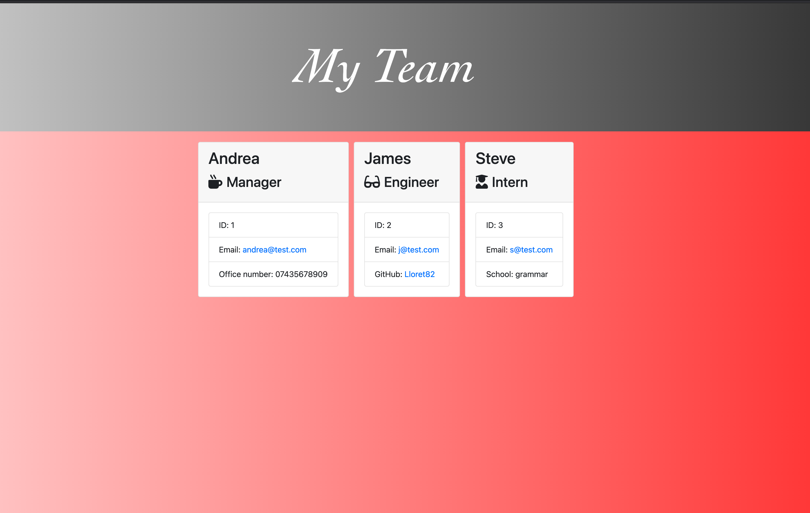

# Team-Profile-Generator

## Description
this generator has been created to help company creating a basic employer's list 
## Table of Contents
* [Installation](#installation)
* [Usage](#usage)
* [Contribution](#contribution)
* [Screenshot](#screenshot)
* [License](#license)
* [Questions](#questions)
* [Video](#Video)
* [Repo](#Repository)

## Installation
1. this software doesn't need installation
2. feel free to fork it

## Usage
once you forked it you can run it in node

## Contribution
feel free to create a new branch and submit your suggestions

## License
This project is convered under the MIT licence.

## Questions
For questions about this project, please see my GitHub at [Lloret82](https://github.com/Lloret82), or reach out by email at andrea.fullstack@gmail.com.

## Video

[Youtube](https://youtu.be/I6h28-X6sfU)

## Repository

[Repo](https://github.com/Lloret82/Team-Profile-Generator)

## Screenshot

